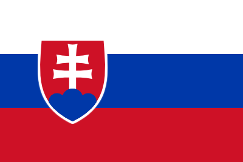

The [Drawable][] that contains overlays (layers) on top of itself.
Those layers can be transformed with a [Matrix][] (scale, translation, rotation) and
any standard android [Animation][] can be applied to.

For example given the background and two layers:

the result might look like:

Typical usage:

    // create a new PatchworkDrawable with background image @drawable/android_background
    PatchworkDrawable ld = new PatchworkDrawable(this, R.drawable.android_background);
    // initialize layers's BitmapDrawable
    Drawable drawable = ...;
    // initialize layer's Matrix
    Matrix matrix = ...;
    // add new layer
    ld.addLayer(drawable, matrix);

    ImageView iv = ...;
    iv.setImageDrawable(ld);

Thank you.

[Drawable]: http://developer.android.com/reference/android/graphics/drawable/Drawable.html
[Matrix]: http://developer.android.com/reference/android/graphics/Matrix.html
[Animation]: http://developer.android.com/reference/android/view/animation/Animation.html
